<!-- ═══════════════════════════ HERO ═══════════════════════════ -->

  

  

  
  
  

<!-- ═══════════════════════════ ABOUT ═══════════════════════════ -->
## 🧑‍💻 About Me

  

  <i>Passionate about building modern, scalable and reliable web applications — 
  solving real-world problems through clean code, thoughtful design and FoodTech.</i>

  <b>“Build useful things. Keep learning. Keep improving.”</b>

<!-- ═══════════════════════════ WHAT I DO ═══════════════════════════ -->
## ⚡ What I Do

<table align="center">
<tr>
<td width="33%" align="center" valign="top">
 
<h3>💻 Full-Stack</h3>
Modern web applications with clean architecture and reliable backend systems.
</td>
<td width="33%" align="center" valign="top">
 
<h3>🎨 UI / UX</h3>
Responsive, accessible interfaces with a focus on developer and user experience.
</td>
<td width="33%" align="center" valign="top">
 
<h3>🍔 FoodTech</h3>
Building <b>FoodStacks</b> and exploring technology for the food ecosystem.
</td>
</tr>
</table>

<!-- ═══════════════════════════ TECH STACK ═══════════════════════════ -->
## 🛠️ Tech Stack

<table align="center">
<tr>
<td align="center"><b>💻 Languages</b></td>
<td></td>
</tr>
<tr>
<td align="center"><b>🌐 Frontend</b></td>
<td></td>
</tr>
<tr>
<td align="center"><b>⚙️ Backend</b></td>
<td></td>
</tr>
<tr>
<td align="center"><b>☁️ Tools & Infra</b></td>
<td></td>
</tr>
</table>

  
  
  

<!-- ═══════════════════════════ STATS ═══════════════════════════ -->
## 📊 GitHub Statistics

  
  

  

  
  

<!-- ═══════════════════════════ SNAKE ═══════════════════════════ -->
## 🐍 Contribution Activity

  <picture>
    <source media="(prefers-color-scheme: dark)" srcset="https://raw.githubusercontent.com/SarayutMind/SarayutMind/output/github-contribution-grid-snake-dark.svg" />
    <source media="(prefers-color-scheme: light)" srcset="https://raw.githubusercontent.com/SarayutMind/SarayutMind/output/github-contribution-grid-snake.svg" />
    
  </picture>

<!-- ═══════════════════════════ FOODSTACKS ═══════════════════════════ -->

  

  <b>FoodStacks</b> is part of my journey to explore how technology can make 
  the food ecosystem <b>smarter</b>, <b>faster</b> and <b>more connected</b>.

  

<!-- ═══════════════════════════ LEARNING ═══════════════════════════ -->
## 🎯 Currently Learning

  

  

<!-- ═══════════════════════════ QUOTE ═══════════════════════════ -->
## 💬 Dev Quote

  

<!-- ═══════════════════════════ CONNECT ═══════════════════════════ -->
## 🌐 Connect With Me

  
  
  

<!-- ═══════════════════════════ FOOTER ═══════════════════════════ -->

  

  

