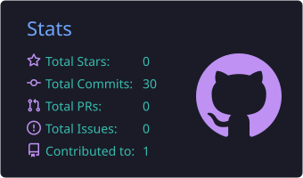
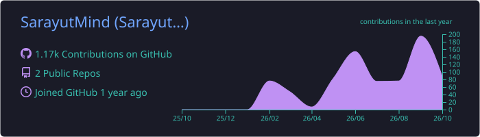
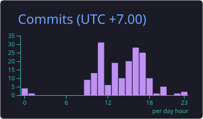

# 👋 Hi, I'm Sarayut Pintakham

  

  

  
  
  

---

## 🧑‍💻 About Me

I'm a **Full-Stack Developer** passionate about building modern, scalable and reliable web applications.

My work focuses on solving **real-world problems** through clean code, thoughtful design and FoodTech.

* 🌍 Based in **Mueang Bueng Kan, Thailand**
* 💻 Full-Stack Web Developer
* 🍔 Working on **FoodStacks**
* ⚡ Interested in real-time and scalable systems
* 🧠 Currently learning **PostgreSQL, Go & Python**
* 🎨 Focused on clean UI/UX and developer experience

> **Build useful things. Keep learning. Keep improving.**

---

## ⚡ What I Do

<table>
<tr>
<td width="33%" align="center">

### 💻 Full-Stack

Building modern web applications with clean architecture and reliable backend systems.

</td>

<td width="33%" align="center">

### 🎨 UI / UX

Designing responsive, accessible interfaces with a focus on developer and user experience.

</td>

<td width="33%" align="center">

### 🍔 FoodTech

Building **FoodStacks** and exploring technology for the food ecosystem.

</td>
</tr>
</table>

---

## 🛠️ Tech Stack

### 💻 Languages

  

### 🌐 Frontend

  

### ⚙️ Backend

  

### ☁️ Tools & Infrastructure

  

---

## 🎮 Developer Mode

  

  
  

  
  
  

---

## 📊 GitHub Statistics

  
  

  

---

## 💻 Most Used Languages

  <picture>
    <source media="(prefers-color-scheme: dark)" srcset="https://raw.githubusercontent.com/SarayutMind/github-stats/generated/languages.svg#gh-dark-mode-only" />
    
  </picture>

---

## ⏰ Productive Time

  

---

## 🐍 Contribution Activity

  <picture>
    <source
      media="(prefers-color-scheme: dark)"
      srcset="https://raw.githubusercontent.com/SarayutMind/SarayutMind/output/github-contribution-grid-snake-dark.svg"
    />
    <source
      media="(prefers-color-scheme: light)"
      srcset="https://raw.githubusercontent.com/SarayutMind/SarayutMind/output/github-contribution-grid-snake.svg"
    />
    
  </picture>

---

## 🚀 FoodStacks

  

  <b>FoodStacks</b> is part of my journey to explore how technology can make the food ecosystem smarter, faster and more connected.

---

## 🎯 Currently Learning

  

`PostgreSQL`  •  `Go`  •  `Python`

---

## 💬 Dev Quote

  

---

## 🌐 Connect With Me

  
  
  

---

### ⚡ Build. Learn. Connect. Repeat.

